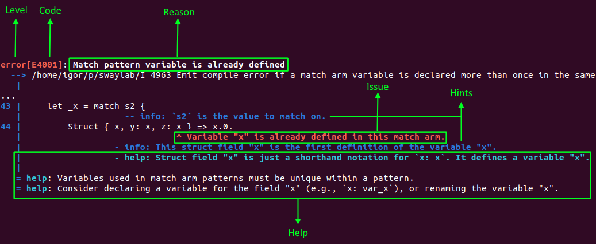

- Feature Name: `expressive_diagnostics`
- Start Date: 2023-08-07
- RFC PR: [FuelLabs/sway-rfcs#0000](https://github.com/FuelLabs/sway-rfcs/pull/001)
- Sway Issue: [FueLabs/sway#0000](https://github.com/FuelLabs/sway/issues/001)

# Summary

[summary]: #summary

Expressive diagnostics will provide detailed, helpful, and human friendly diagnostics (warnings and errors) to Sway programmers. The diagnostic messages will be focused on the code that the programmer wrote and will lead the programmer to a possible issue resolution. At the same time, the internal implementation of diagnostics will empower Sway language developers to easily define detailed and helpful diagnostics. The implementation, the Diagnostics API, will also enforce consistent warning and error reporting.

# Motivation

[motivation]: #motivation

There is an overwhelming evidence, based on experience<sup>[1],[2],[3],[4]</sup> and research<sup>[5],[6],[7]</sup>, that shows that the quality of compiler diagnostics has a significant influence on:

- the programmer's perception of the language
- steepness of the language learning curve
- and programmer's productivity.

Experience from several communities, like Rust<sup>[2]</sup>, Elm<sup>[3]</sup>, and C++<sup>[1],[5],[8]</sup>, to name a few, has shown that improving diagnostics had a great impact on the three points listed above.

At the moment, Sway diagnostics vary significantly in level of details, wording, and helpfulness. We have messages that strive to be helpful and give hints to the programmer. E.g.:

```
Generic type \"{name}\" is not in scope. Perhaps you meant to specify type parameters in \
    the function signature? For example: \n`fn \
    {fn_name}<{comma_separated_generic_params}>({args}) -> ... `
```

The way how we structure those messages is, however, not standardized. E.g., here is an another attempt to provide a detailed error explanation, formatted and conveyed in a completely different way:

```
expected: {expected} \n\
    found:    {given} \n\
    help:     The definition of this {decl_type} must \
    match the one in the {interface_name} declaration.
```

At the moment, although detailed and helpful, these messages are "packed" within a single piece of text pointing to a single place in code. This significantly limits amount of helpful information that can be provided to the programmer. It also limits the presentation of the context in which the diagnostic occurs. The overall context usually spans across several points in code. We want to be able to place the useful information on the exact places in code that are relevant to the diagnostic.

Sway programmers are also confronted with short, sometimes cryptic error messages, containing jargon used by compiler developers. E.g.:

```
Invalid value \"{value}\"
```

```
Constant requires expression.
```

Internally, expressive diagnostics will empower Sway language developers to easily define detailed and helpful diagnostics that will be focused on the exact code that the programmer wrote. Diagnostics API will also provide a unified way to define diagnostics. (At the moment we have three different approaches for defining diagnostics. `CompileError`, `CompileWarning`, and `ParseError` are representatives of those different approaches.)

Externally, we expect to see the effects experienced in other communities:

- better perception of Sway as a language
- easier language learning curve
- increased efficiency in resolving compiler errors and warnings.

# Guide-level explanation

[guide-level-explanation]: #guide-level-explanation

Diagnostics will be displayed in different clients. E.g.:

- `forc` CLI output.
- VS Code hints.
- VS Code compiler output.
- VS Code Problems.

Each client can choose which part of diagnostic to show and how.

When using `forc` CLI Sway programmers will get detailed diagnostics consisting of the following elements:

- _Level_: Error or Warning.
- _Code_: Unique code of the diagnostic.
- _Reason_: Short description of the diagnostic, not related to a specific issue that the programmer did. The _reason_ answers the question "Why is this an error or warning?" E.g., Because - "Match pattern variable is already defined". It points out the general language rule that was violated.
- _Issue_: Description of the concrete issue caused by the programmer, placed in the source code. E.g., "Variable "x" is already defined in this match arm."
- _Hints_: Detailed descriptions of the diagnostic, placed in the source code. They point to other places in code that give additional contextual information about the issue.
- _Help_: Additional friendly information, that helps better understanding and solving the issue. Same as hints, help entries can be related to a place in code, or they can be placed in the footnotes.



When using IDEs like VS Code Sway programmers will have the experience similar to one offered by the [Rust analyzer](https://rust-analyzer.github.io/).

Popup in the editor could provide the _reason_, _issue_, _hints_, as well as the _help_, similar to this Rust example:


Programmer will have the option to open the full compiler diagnostic, getting the same output like when using `forc` CLI, similar to this Rust example:


Diagnostics will also be displayed in VS Code problems:


## Wording guidelines

When defining diagnostics, it is important to have in mind all the clients listed above. A diagnostic must not be optimized for one output, e.g., CLI but be hardly understandable in e.g., VS Code hints.

To ensure consistency and apply best practices<sup>[5]</sup> the diagnostics will follow these guidelines:

- _Reason_ will be short and point out the language constraint which was violated. It will _not_ finish in full stop, to emphasize brevity.
- _Issue_ will be short and point out the specific situation encountered in code. It is written in plain english, using proper punctuation and grammar rules.
- _Reason_ and _issue_ are given in plain english language, free of, e.g., compiler jargon.
- _Hints_ and _help_ are as well written in plain english, using proper punctuation and grammar rules.
- _Hints_ and _help_ try to give as much of useful context as possible and to be as specific as possible.
- _Help_ in footnotes should be used rarely, only for general explanations and suggestions. Preferably, _help_ should be related to a place in code.
- Identifier and type names in messages are enclosed in "double quotes". E.g., "x" or "(u32, bool)".
- Code samples in messages are enclosed in \`grave accents\`. E.g., \`let x = 0\`.
- Articles "the" and "a/an" are not used at the beginning of a sentence. E.g., "Variable "X" is already..." instead of "The variable "X" is already...". They can be used in formulations like "This is _the_ original declaration...".

To avoid unnecessary complexity that comes through high number of diagnostic reasons (both for Sway language developers and Sway programmers), we will introduce new error codes restrictively. Reusing existing error codes and reasons will be the preferable option. To communicate specific cases we will use _hints_ and _help_.

Here is an example. The existing error message:

```
Name "MyName" is defined multiple times.
```

could, depending on the context, have the following form:

```
Reason: Item names must be unique
Issue:  There is already an imported struct with the name "MyName"
Hints:  [error] This is the enum "MyName" that has the same name as the imported struct.
        [info]  The struct "MyName" gets imported here.
        [info]  This is the original declaration of the imported struct "MyName".
Help:   Items like structs, enums, traits, and ABIs must have a unique name in scope.
        Consider renaming the enum "MyName" or using an alias for the imported struct.
```

## Diagnostic codes

A diagnostic _code_ uniquely identifies a particular _reason_. Considering that we already have these diagnostic areas:

- Lexical analysis
- Parsing
- Parse tree conversion
- Type checking
- Semantic analysis
- Warnings

the pragmatic way to ensure uniqueness and assignment of a new code number is to have a code made of three parts:

&lt;letter E or W for error or warning respectively&gt;&lt;one digit area code&gt;&lt;three digit code unique for area&gt;

E.g, _E4001_ would be the first error in the semantic analysis area.

Diagnostic codes will be used to:

- point to detailed diagnostic explanation similar to [Rust online help for error messages](https://doc.rust-lang.org/error_codes/error-index.html).
- suppress warnings by using a Sway equivalent of Rust's [#[allow]](https://docs.rs/allow/latest/allow/).

In case of warnings, in addition to the _code_ explained above, diagnostic will have a human-readable identifier which will allow us to have human-readable, self-documenting `#[allow]`s, similar to the [Clippy lint identifiers](https://rust-lang.github.io/rust-clippy/master/index.html#/Configuration).

When [defining warnings via proc-macros](#reference-level-explanation), the human-readable identifier will be defined, next to the _code_:

```Rust
    ...
    #[warning(
        reason(1, name_is_not_idiomatic, "Name is not idiomatic"),
    ...
```

This identifier can then be used in `#[allow]`s:

```Rust
#[allow(name_is_not_idiomatic)]
type int8_t = i8;
```

In addition, we will add the option to Sway compiler to treat warnings as errors.

# Reference-level explanation

[reference-level-explanation]: #reference-level-explanation

We already have the `Diagnostic` struct modeled after the definition given above. This allows us to enforce the usage of expressive diagnostics via API that models the explained approach.

`forc` uses the `ToDiagnostic` trait, implemented at the moment only by `CompileError` and `CompileWarning`, to rended expressive diagnostics for error and warning messages that support them.

Both implementations of `ToDiagnostic` provide a fallback that renders a diagnostic indistinguishable from the existing error and warning messages. This ensures backward compatibility and gradual switch to expressive diagnostics.

At the moment, `Diagnostic` instances can be created only imperatively, by using the Diagnostics API and manually creating the whole `Diagnostic` structure, `Reason`, `Code`, `Issue`, `Hint`s, etc. This is cumbersome and requires writing boilerplate code. It can be compared to creating error messages without [thiserror](https://docs.rs/thiserror/latest/thiserror/) as we do in `CompileWarning`.

The proposal is to have a proc-macro for declarative definition of an expressive diagnostic.

E.g., the const shadowing diagnostic given above would be defined as follows:

```Rust
#[derive(Diagnostic, Debug, Clone, PartialEq, Eq, Hash)]
#[diagnostic(area = DiagnosticArea::SemanticAnalysis)]
pub enum CompileError {
    ...
    #[error(
        reason(1, "Constants cannot be shadowed"),
        issue(
            name.span(),
            "{variable_or_constant} \"{name}\" shadows {}constant with the same name",
            if constant_decl.is_some() { "imported " } else { "" }
        ),
        info(
            constant_span.clone(),
            "Constant \"{name}\" {} here{}.",
            if constant_decl.is_some() { "gets imported" } else { "is declared" },
            if *is_alias { " as alias" } else { "" }
        ),
        info(
            constant_decl.map(|x| x.clone()),
            "This is the original declaration of the imported constant \"{name}\"."
        ),
        error(
            name.span(),
            "Shadowing via {} \"{name}\" happens here.", 
            if variable_or_constant == "Variable" { "variable" } else { "new constant" }
        ),
        help("Unlike variables, constants cannot be shadowed by other constants or variables."),
        help(
            match (variable_or_constant.as_str(), constant_decl.is_some()) {
                ("Variable", false) => format!("Consider renaming either the variable \"{name}\" or the constant \"{name}\"."),
                ("Constant", false) => "Consider renaming one of the constants.".to_string(),
                (variable_or_constant, true) => format!(
                    "Consider renaming the {} \"{name}\" or using {} for the imported constant.",
                    variable_or_constant.to_lowercase(),
                    if *is_alias { "a different alias" } else { "an alias" }
                ),
                _ => unreachable!("We can have only the listed combinations: variable/constant shadows a non imported/imported constant.")
            }
        )
    )]
    ConstantsCannotBeShadowed {
        variable_or_constant: String,
        name: Ident,
        constant_span: Span,
        constant_decl: Option<Span>,
        is_alias: bool,
    },
    ...
}
```

_Issue_ and _infos_ point to places in code, and are commonly named _labels_. The places in code they refer to are given by `Span`s.
`issue` and `info` elements of `#[error]` take `Span` or `Option<Span>` as their first argument, as seen above. If the passed `Span` parameter is `None` the _label_ is considered _not to be in source code_.

For _hints_, not being in source code means that they are not rendered at all. Diagnostics API will ignore them and clients (CLI, LSP) will not be aware of them.

For the _issue_, clients will always display it as a part of diagnostic description. If it is in code, clients can choose to additionally display it in code.
E.g., `forc` always shows the _issue_ text as a part of the diagnostic description, but if the _issue_ is in code and there is a _hint_ pointing to the same place in code, the _issue_ will not be rendered as a _label_ in code. This overloading of the _issue_ text by a _hint_ is visible on the above example and is enforced via Diagnostics API. It gives us the flexibility to phrase the diagnostic description and the hints in an independent way, while allowing backward compatibility with the current warnings and errors that have only a single message and span.

Using `None` to denote non-existence of an element allows declarative definition of all the _hints_, knowing that some of them might not be shown, depending on the concrete `Span` value passed to the enum variant.

Our `Diagnostic` derive and `thiserror`'s `Error` derive would coexist as long as the "old-style" diagnostic do not get fully replaced with expressive diagnostic. The existing fallback mechanism would still be generated by the `Diagnostic` derive.

Treating warnings as errors should be straightforward. It requires an additional compilation flag whose check will be added at final receivers of the diagnostics, before the next step in the compilation pipeline. E.g., before we generate IR we treat warnings as errors and stop the IR generation.

# Drawbacks

[drawbacks]: #drawbacks

The only drawback I can think of is the time and effort needed to fully roll out the expressive diagnostic. This means to replace _all_ of the existing diagnostics with their expressive counterparts.

Out of the experience gained while working on [supporting multi-span errors and warnings](https://github.com/FuelLabs/sway/issues/21) I can say that crafting a good expressive diagnostic takes time, as well as adjusting existing e2e tests. Coding the diagnostics itself is a negligible effort.

But this replacement can and should be done gradually, as a side task. It should be distributed among Sway language developers and other teams that want to contribute. The same approach was taken, e.g., by [Rust](https://github.com/rust-lang/rust/issues/35233) and [Elm](https://elm-lang.org/news/compiler-errors-for-humans) communities.

# Rationale and alternatives

[rationale-and-alternatives]: #rationale-and-alternatives

Not implementing expressive diagnostics would mean staying behind the modern approach to compiler diagnostics. Expressive diagnostics are becoming de facto standard in compiler development (see the [Prior art](#prior-art) section below). To position Sway as a modern and developer friendly language, we have to follow this standard. I don't see how we can choose not to implement expressive diagnostics.

To the proposed design, the approach and its alternatives were shortly discussed when implementing [support for multi-span errors and warnings](https://github.com/FuelLabs/sway/issues/21).

## Alternative 1: Using generic diagnostic structure

This approach would mean having a possibility do define an arbitrary diagnostic, similar to an arbitrary output that can be achieved by using `Snippet`, `Slice`, `Annotation`, and other abstractions provided by [annotate-snippets](https://github.com/rust-lang/annotate-snippets-rs). We have concluded that this additional freedom would not give us any more expressive power, but just create additional confusion when defining diagnostics. It would also very likely lead toward inconsistencies similar to those we have now (different wording, different ways to explain an issue, etc.).

## Alternative 2: Evaluating and using `miette` crate

[miette](https://github.com/zkat/miette) crate provides a holistic library for defining, reporting, and rendering diagnostics. We have concluded that using `miette` would mean changing our existing infrastructure that already works well plus losing the flexibility if we decide to do thing differently then envisioned by `miette`. The conclusion was to approach `miette` as an inspiration for our own API.

# Prior art

[prior-art]: #prior-art

## Expressive diagnostics
Expressive diagnostics are gaining relevance, or are already significant part of compilers like:

- Rust<sup>[2]</sup>
- GCC<sup>[5], [8]</sup>
- Clang<sup>[1]</sup>
- Elm<sup>[3]</sup>

Microsoft puts an effort in improving diagnostics in their VC++ compiler<sup>[5]</sup>.

Java error messages, traditionally knowing to be terse and difficult for novices and students, are enhanced with tools like Decaf, or Expresso<sup>[7]</sup>.

## Using macros for diagnostic definition

`thiserror` and its macros are de facto standard for defining error messages in Rust.

`miette` follows the same approach for defining rich diagnostics, with its `diagnostic` macro:

```Rust
#[diagnostic(
    code(oops::my::bad),
    url(docsrs),
    help("try doing it better next time?")
)]
```

## Using diagnostic codes

Unique diagnostic codes can be find in many compilers including [Rust](https://doc.rust-lang.org/error_codes/error-index.html), [Clang](https://clang.llvm.org/docs/InternalsManual.html#the-diagnostics-subsystem), and [C#](https://github.com/thomaslevesque/GenerateCSharpErrors/blob/master/CSharpErrorsAndWarnings.md). They can be used to:

- point to detailed diagnostic explanation
- suppress warnings

Rust takes advantage of both possibilities by offering [online help for error messages](https://doc.rust-lang.org/error_codes/error-index.html) and a possibility to suppress warnings by using [#[allow]](https://docs.rs/allow/latest/allow/).

# Unresolved questions

[unresolved-questions]: #unresolved-questions

The RFC has no unresolved questions. During the discussion, the following questions were resolved:

- the structure of the Diagnostic API.
- the usage of symbolic warning identifiers like e.g., `name_is_not_idiomatic` in addition to warning codes like e.g., `W0001`.

# Future possibilities

[future-possibilities]: #future-possibilities

Once we get online documentation for diagnostics (as proposed in [Sway 3512](https://github.com/FuelLabs/sway/issues/3512)) we can extend diagnostic messages with links to detailed explanation by adding an element like:

```
info: For more information see: https://.../E4001
```

Similar to Rust, we can also add the _explain_ command to `forc`. E.g.:

```
forc explain E4001
```

Once _The Sway Book_ and _The Sway Reference_ become stable we can also enhance `Diagnostic` by adding references to the documentation. E.g.:

```Rust
#[error(
    reason(1, "Constants cannot be shadowed"),
    ...
    book("Shadowing", "relative/path/to/chapter/shadowing"),
    ref("Constants", "relative/path/to/chapter/constants"),
    ...
)]
```

This would render additional _info_ lines. E.g.:

```
info: For more information, see:
      - the chapter "Shadowing" in The Sway Book: https://.../shadowing
      - the chapter "Constants" in The Sway Reference: https://.../constants
```

# References

[references]: #references

- [1] [Expressive Diagnostics](https://clang.llvm.org/diagnostics.html)
- [2] [Shape of errors to come](https://blog.rust-lang.org/2016/08/10/Shape-of-errors-to-come.html)
- [3] [Compiler Errors for Humans](https://elm-lang.org/news/compiler-errors-for-humans)
- [4] [Compilers as Assistants](https://elm-lang.org/news/compilers-as-assistants)
- [5] [Concepts Error Messages for Humans](https://www.open-std.org/jtc1/sc22/wg21/docs/papers/2022/p2429r0.pdf)
- [6] [Compiler Error Messages Considered Unhelpful: The Landscape of Text-Based Programming Error Message Research](https://web.eecs.umich.edu/~akamil/papers/iticse19.pdf)
- [7] [An Effective Approach to Enhancing Compiler Error Messages](https://dl.acm.org/doi/pdf/10.1145/2839509.2844584)
- [8] [Usability improvements in GCC 8](https://developers.redhat.com/blog/2018/03/15/gcc-8-usability-improvements#)

[1]: https://clang.llvm.org/diagnostics.html "Expressive Diagnostics"
[2]: https://blog.rust-lang.org/2016/08/10/Shape-of-errors-to-come.html "Shape of errors to come"
[3]: https://elm-lang.org/news/compiler-errors-for-humans "Compiler Errors for Humans"
[4]: https://elm-lang.org/news/compilers-as-assistants "Compilers as Assistants"
[5]: https://www.open-std.org/jtc1/sc22/wg21/docs/papers/2022/p2429r0.pdf "Concepts Error Messages for Humans"
[6]: https://web.eecs.umich.edu/~akamil/papers/iticse19.pdf "Compiler Error Messages Considered Unhelpful: The Landscape of Text-Based Programming Error Message Research"
[7]: https://dl.acm.org/doi/pdf/10.1145/2839509.2844584 "An Effective Approach to Enhancing Compiler Error Messages"
[8]: https://developers.redhat.com/blog/2018/03/15/gcc-8-usability-improvements "Usability improvements in GCC 8"