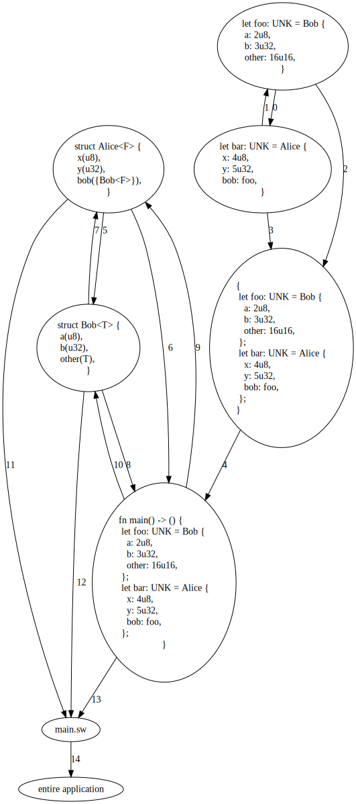
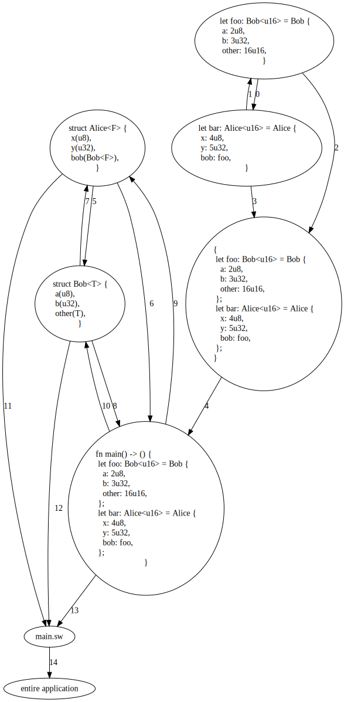

- Feature Name: `collection_context`
- Start Date: 2022-09-19
- RFC PR: [FuelLabs/sway-rfcs#0015](https://github.com/FuelLabs/sway-rfcs/pull/15)
- Sway Issue: [FueLabs/sway#1819](https://github.com/FuelLabs/sway/issues/1819)

# Summary

[summary]: #summary

With its current design, the Sway compiler faces challenges regarding how nodes interact
with one another during type checking. These include:

1. Mutually recursive dependencies are not supported, and could not be supported without
    extensive special casing.
2. Recursive AST nodes are not currently supported, and could not be supported without
    extensive special casing.
3. This inhibits the introduction of recursive functions, complex application development
    requiring circular dependencies, and more.
4. If a user forgets to import a dependency, it is not tractable to suggest an import to
    them at the compiler level without extensive special-casing.

This RFC proposes a two-themed solution to this problem. At a high level, theme one of this
RFC is a change to the internal design of the compiler to disentangle AST transformation
from type inference and type checking. The second theme of this RFC is a new "collection
context" that allows the compiler to introduce steps for graph collection and type
collection, in addition to type inference and type checking. All together, this allows the
compiler to solve the issues listed above.

[*prototype system*](https://github.com/emilyaherbert/declaration-engine-and-collection-context-demo/tree/master/de)

# Motivation

[motivation]: #motivation

Why are we doing this? What use cases does it support? What is the expected outcome?

With the changes introduced by this RFC, the compiler will be able to solve the issues listed
above. Sway could support recursive functions and complex applications that require
circular dependencies. The push to disentangle AST transformation from the other inner
AST operations will also introduce a new mechanism in the compiler that will allow for more
robust growth in the future.

# Guide-level explanation

[guide-level-explanation]: #guide-level-explanation

## AST transformation disentanglement

Currently, the compiler does all of the type inference and type checking in a single pass---the
same pass as the AST transformation from the untyped AST to the 'fully typed AST'. This RFC
disentangles these concepts, and replaces the 'fully typed AST' with a 'typeable AST'. All-in-all
the 'typeable AST' is very similar to the 'fully typed AST'---a big part of this change is simply
a mindset shift from 'fully typed' to 'typeable'. However, the 'typeable AST' includes additional
fields that allow the compiler to index into the collection context.

## Collection Context

At a high-level, the collection context represents an AST as a graph by adding AST nodes into
a graph and by drawing edges between relevant AST nodes. An edge is created between two AST
nodes when those two AST nodes share some scope relationship---sharing the same scope, one
being a scoped child of another, etc.

The collection context is a cyclical directed graph that allows for both parallel edges
and for self-referential edges. This is useful for the AST because it allows us to model
scoping relationships. The 'leaves' of the collection context are nodes from which no other
nodes derive any nested scoping (think literal expressions, variable expression, etc). Edges
in the graph are directed towards outward scope. For example, an AST node in a function body
will have an edge pointing outward in scope towards the AST node of the function declaration
itself. And that function declaration will have and edge pointing outward in scope to the
file its in. In this way, the root of the graph is the entire application itself, as it
encompasses the most outward scope.

Modeling scope in this way is useful because it allows the compiler to 'look ahead' at
'future AST nodes' during type collection, type inference, etc. We can think of it in this way.
Given this example (it's a silly example, don't think about the fact that this will never
terminate, that doesn't matter for what we are looking at):

```rust
fn ping(n: u64) -> u64 {
    return pong(n);
}

fn pong(n: u64) -> u64 {
    return ping(n);
}
```

During type inference, when evaluating the AST node for `return pong(n);`, we will need to
know 1) the type signature of `pong` and 2) if `pong` exists at all and is in scope, but we
don't know this information because we haven't done type inference on `pong` yet. Because these
functions are mutually recursive, it is not possible to determine an ordering for which to do
type inference. The collection context gives the ability for the compiler to either 'look
forward' or 'look backward' in the AST given any location where type inference is currently 'standing'.

## Mutually Recursive Dependencies

Take these two Sway files (currently does not compile):

`alice.sw`:

```rust
library alice;

use ::bob::*;

fn alice_fn(n: u64) -> u64 {
    if n == 0 {
        return 99;
    } else {
        return bob_fn(n-1);
    }
}
```

`bob.sw`:

```rust
library bob;

use ::alice::*;

fn bob_fn(n: u64) -> u64 {
        if n == 0 {
        return 1;
    } else {
        return alice_fn(n-1);
    }
}
```

In this case, the collection context would allow the compiler to immutably search the contents of both
`alice.sw` and `bob.sw`, in any order, regardless of whether `alice_fn` is being type checked first or
`bob_fn` is.

## "Did you forget to import X in file Y?" Compiler Error

Take the same example as above, but this time the user has forgotten an import statement:

`alice.sw`:

```rust
library alice;

// use ::bob::*;
//
// ^^^ they forgot this

fn alice_fn(n: u64) -> u64 {
    if n == 0 {
        return 99;
    } else {
        return bob_fn(n-1);
    }
}
```

`bob.sw`:

```rust
library bob;

use ::alice::*;

fn bob_fn(n: u64) -> u64 {
        if n == 0 {
        return 1;
    } else {
        return alice_fn(n-1);
    }
}
```

When type checking `alice_fn`, the compiler is able to use the collection context to see that there does exist
a `bob_fn` function, but that it is out of scope. This information is able to be used to gives better
error messages and better error recovery.

# Reference-level explanation

[reference-level-explanation]: #reference-level-explanation

The [proposed stages of the compiler](https://github.com/emilyaherbert/declaration-engine-and-collection-context-demo/blob/master/de_cc/src/lib.rs#L24) are:

1. parsing
2. [AST transformation from the untyped AST to the typeable AST and graph collection](https://github.com/emilyaherbert/declaration-engine-and-collection-context-demo/blob/master/de_cc/src/semantic_analysis/graph_collection/mod.rs)
    - insert instances of `TypeInfo` into the `TypeEngine`
    - insert declarations into the `DeclarationEngine`
    - create the collection context
    - NOT evaluate types in any way
    - NOT create constraints on types or perform type unification
    - NOT resolve instances of custom types
3. [type collection](https://github.com/emilyaherbert/declaration-engine-and-collection-context-demo/blob/master/de_cc/src/semantic_analysis/type_collection/mod.rs)
    - visiting all intraprocedural definitions (struct/enum/function/trait/etc declarations)
    - resolving custom types
    - associating type parameters with generics
    - NOT visiting non-intraprocedural definitions (function bodies are not visited)
4. [type inference (+ type checking)](https://github.com/emilyaherbert/declaration-engine-and-collection-context-demo/blob/master/de_cc/src/semantic_analysis/type_inference/mod.rs)
    - visiting all function bodies and expressions
    - resolving custom types
    - monomorphizing as needed

## Typeable AST

The [typeable AST](https://github.com/emilyaherbert/declaration-engine-and-collection-context-demo/blob/master/de_cc/src/language/ty/mod.rs) is defined as (this is a super simplified subset):

```rust
struct TyApplication {
    files: Vec<CCIdx<TyFile>>,
}

struct TyFile {
    name: String,
    nodes: Vec<CCIdx<TyNode>>,
}

enum TyNode {
    StarImport(String),
    Declaration(CCIdx<TyDeclaration>),
    Expression(TyExpression),
    ReturnStatement(TyExpression),
}

enum TyDeclaration {
    Variable(TyVariableDeclaration),
    Function(CCIdx<DeclarationId>),
    Trait(CCIdx<DeclarationId>), // definition omitted for typeable trait declaration
    TraitImpl(CCIdx<DeclarationId>), // definition omitted for typeable trait impl
    Struct(CCIdx<DeclarationId>), // definition omitted for typeable struct declaration
}

struct TyFunctionDeclaration {
    name: String,
    type_parameters: Vec<TypeParameter>,
    parameters: Vec<TyFunctionParameter>,
    body: CCIdx<TyCodeBlock>,
    return_type: TypeId,
}

struct TyFunctionParameter {
    name: String,
    type_id: TypeId,
}

struct TyCodeBlock {
    contents: Vec<CCIdx<TyNode>>,
}

struct TyExpression {
    variant: TyExpressionVariant,
    type_id: TypeId,
}

enum TyExpressionVariant {
    Literal {
        value: Literal,
    },
    Variable {
        name: String,
    },
    FunctionApplication {
        name: String,
        type_arguments: Vec<TypeArgument>,
        arguments: Vec<TyExpression>,
    },
    FunctionParameter,
    Struct {
        struct_name: String,
        type_arguments: Vec<TypeArgument>,
        fields: Vec<TyStructExpressionField>,
    },
    MethodCall {
        parent_name: String,
        func_name: String,
        type_arguments: Vec<TypeArgument>,
        arguments: Vec<TyExpression>,
    },
}
```

`CCIdx` is an index into the [collection context](https://github.com/emilyaherbert/declaration-engine-and-collection-context-demo/blob/master/de_cc/src/collection_context/mod.rs):

```rust
type CollectionGraph = petgraph::Graph<CollectionNode, CollectionEdge>;

enum CollectionNode {
    StarImport(String),
    Application(TyApplication),
    File(TyFile),
    Expression(TyExpression),
    Return(TyExpression),
    Variable(String, TyVariableDeclaration),
    Function(String, DeclarationId),
    CodeBlock(TyCodeBlock),
    Trait(String, DeclarationId),
    TraitFn(String, DeclarationId),
    TraitImpl(String, DeclarationId),
    Struct(String, DeclarationId),
}

enum CollectionEdge {
    ApplicationContents,
    FileContents,
    SharedScope,
    ScopedChild,
}

struct CCIdx<T> {
    inner: T,
    idx: CollectionIndex,
}

struct CollectionIndex(petgraph::NodeIndex);

struct CollectionContext {
    pub(super) graph: CollectionGraph,
    pub(super) files: HashMap<String, CollectionIndex>,
}
```

`CollectionEdge`'s are added between nodes that share a scoping relationship. For example,
here is the pseudo-code for
[doing AST transformation and graph collection for a function declaration](https://github.com/emilyaherbert/declaration-engine-and-collection-context-demo/blob/master/de_cc/src/semantic_analysis/graph_collection/declaration.rs):

```rust
fn graph_collection_function(
    cc: &mut CollectionContext,
    func_decl: FunctionDeclaration,
) -> CCIdx<DeclarationId> {
    // 1. do graph collection on the function parameters

    // 2. do graph collection on the function body
    let .. = graph_collection_code_block(cc, func_decl.body);

    // 3. create the `TyFunctionDeclaration` object
    let func_decl = ..;

    // 4. insert the function into the declaration engine to get the declaration id

    // 5. add the declaration id to the collection context as a `CollectionNode::Function(..)`

    // 6. create a CCIdx for the declaration id
    let func_decl_cc_idx = ..;

    // 7. add an edge from the function body to the function declaration
    CCIdx::add_edge(
        &func_decl.body,
        &func_decl_cc_idx,
        CollectionEdge::ScopedChild,
        cc,
    );

    func_decl_cc_idx
}

fn graph_collection_code_block(cc: &mut CollectionContext, nodes: Vec<Node>) -> CCIdx<TyCodeBlock> {
    // 1. do graph collection on the ast nodes
    let nodes = ..;

    // 2. for every ast node in the code block, connect them under the same shared scope
    CCIdx::add_edges_many(&nodes, CollectionEdge::SharedScope, cc);

    // 3. create the `TyCodeBlock` object
    let code_block = ..;

    // 4. add the code block to the collection context

    // 5. create a CCIdx for the code block
    let code_block_cc_idx = ..;

    // 6. add an edge from every ast node to the code block
    CCIdx::add_edges_many_to_one(
        &code_block.contents,
        &code_block_cc_idx,
        CollectionEdge::ScopedChild,
        cc,
    );

    code_block_cc_idx
}
```

When type checking a function call, say in the ping-pong example above, the compiler searches for the
`pong` function using a breadth-first search of the `CollectionContext`, meaning anything in the closest
local scope is discovered first. Because the `TyDeclaration::Function` variant and the
`CollectionNode::Function` variant both hold a `DeclarationId`, this `DeclarationId` can refer to the
same typeable `TyFunctionDeclaration` across passes of type collection, type inference, and type checking.
At certain moments, the types within this `TyFunctionDeclaration` may be `TypeInfo::Unknown` (after graph
collection but before type collection), but as the typeable AST undergoes type inference and type checking,
these `TypeId`'s resolve in the `TypeEngine` to concrete types.

## Recursive Data Structures

From my understanding, it's impossible to do type inference on truly recursive data structures (i.e. those
that would be of infinite size) as you need to
[fulfill these requirements](https://papl.cs.brown.edu/2020/types.html#(part._.Recursive_.Datatype_.Definitions)).
For example:

```rust
struct Data1 {
    other: Data2
}

struct Data2 {
    other: Data1
}
```

In these instances, the compiler performs an [occurs check](https://papl.cs.brown.edu/2020/Type_Inference.html)
to check whether the same type variable occurs on both sides and, if it does, it produces a compile error.

I propose that we use an occurs check detect to recursive data structures until we fully support an equivalent
to something like the Rust `Box` type, which would eliminate this problem.

## Program Visualization

The `CollectionContext` uses [petgraph](https://github.com/petgraph/petgraph) under the hood, meaning we get
to benefit from how awesome this library is. So, one of the cool things we can do is we can actually print
the `CollectionContext` to a `.dot` file and visualize the graph.

Given this simple generic function example (`UNK` is the unknown type in the prototype):

```rust
fn F<T>(n: T) -> T {
  let x: T = n;
  let y: UNK = 5u8;
  return x;
};

fn main() -> () {
  let foo: UNK = F(1u32);
  let bar: UNK = F(1u64);
};
```

We can visualize the program before type inference:



and after type inference, notice that the `UNK`'s have disappeared:



# Drawbacks

[drawbacks]: #drawbacks

I would say developer time and lots of merge conflicts. At the very least, disentangling AST transformation
from type inference and type checking is a must-do, in my opinion, even if the collection context
does not get accepted in this form.

# Rationale and alternatives

[rationale-and-alternatives]: #rationale-and-alternatives

- Why is this design the best in the space of possible designs?
- What other designs have been considered and what is the rationale for not choosing them?
- What is the impact of not doing this?

# Prior art

[prior-art]: #prior-art

Rust separates the ideas of
[type collection](https://rustc-dev-guide.rust-lang.org/type-checking.html#type-collection),
[type checking](https://rustc-dev-guide.rust-lang.org/type-checking.html#type-checking),
and [type inference](https://rustc-dev-guide.rust-lang.org/type-inference.html). And these are
all [disentangled from 'AST lowering'](https://rustc-dev-guide.rust-lang.org/overview.html#hir-lowering).

Relating to the `CollectionContext`, the Rust compiler uses
[queries for demand-driven development](https://rustc-dev-guide.rust-lang.org/query.html). Admittedly,
I'm not as familiar with this on a technical level as I would like to be, but my guess is that they are
using a graph-based approach (combined with the Rust `DefId`) and to achieve the memoization and caching.

# Unresolved questions

[unresolved-questions]: #unresolved-questions

I'd really like to get feedback on how the `CollectionContext` could be improved for use with the LSP.

In terms of what is out of scope for this RFC, I feel that supporting recursive data structures is
definitely out of scope, as it will require us to implement a pointer type.

# Future possibilities

[future-possibilities]: #future-possibilities

Eventually we should plan to move monomorphization to it's own
[monomorphization collection step](https://rustc-dev-guide.rust-lang.org/backend/monomorph.html#collection)
(likely after type inference).

I'd really like to see us use the program visualization provided by petgraph. Maybe users could setup
a debug profile for `forc` that allowed them to visualize their contract calls, visualize which library
functions interact with which ABI functions, etc.

And of course releasing recursive functions is going to be a huge with for Sway I think.
