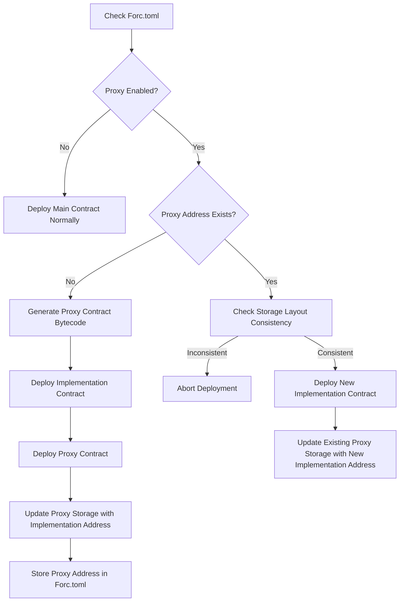

- Feature Name: `contract_proxies`
- Start Date: 2024-05-21
- RFC PR: [FuelLabs/sway-rfcs#0013](https://github.com/FuelLabs/sway-rfcs/pull/39)

# Summary

[summary]: #summary

This proposal introduces a feature to simplify the creation of upgradeable contracts in Sway by enhancing the Forc.toml manifest file.

# Motivation

[motivation]: #motivation

Sway developers want to upgrade their smart contract code post-deployment and need tooling support to facilitate this process. They seek a straightforward method, such as adding a configuration to the Forc.toml file, to enable and manage contract upgradeability seamlessly.

# Guide-level explanation

[guide-level-explanation]: #guide-level-explanation

### Use of the Forc.toml for an upgradeable contact.
This proposal enhances the Forc.toml file to simplify creating upgradeable contracts. A new `[proxy]` table indicates to `forc-deploy` that this contract is upgradable. During the initial deployment, `forc-deploy` stores the proxy contract's address in the `address` field, streamlining future updates and ensuring the address is stored safely with the project.

```toml
[project]
authors = ["Fuel Labs <contact@fuel.sh>"]
entry = "main.sw"
license = "Apache-2.0"
name = "implementation"

[proxy]
enabled = true # Undecided if we really need this flag yet.
address = # this field gets automatically added and filled in during deployment
```

## Workflow

The deployment process takes care of generating proxy bytecode, deploying contracts, and updating addresses automatically. The workflow from forc’s perspective could look something like the following:

1. **Forc Deploy**:
    - Forc deploy checks if the **`proxy.enabled`** field is set to **`true`** in **`Forc.toml`**.
    - If enabled, it checks the **`proxy.address`** field.
        - If **`proxy.address`** is empty, it deploys a new proxy contract, updates the **`proxy.address`** field with the deployed proxy's address, and deploys the implementation contract.
        - If **`proxy.address`** is not empty, it skips deploying a new proxy and proceeds to update the existing proxy's storage to point to the new implementation contract.
2. **Initial Deployment**:
    - Generate the proxy contract bytecode.
    - Deploy the implementation contract.
    - Deploy the proxy contract.
    - Update the proxy contract's storage to point to the implementation contract's address.
    - Store the proxy contract's address in **`Forc.toml`**.
3. **Subsequent Deployments**:
    - Check if a proxy address already exists.
    - Check storage layout consistency between the proxy and the new implementation contract.
    - If storage layout is consistent, deploy the new implementation contract.
    - Update the existing proxy contract to point to the new implementation contract's address.



### **Usability Features**

- **Simplicity**: The system is simple for developers to use. They only need to enable the proxy in **`Forc.toml`**, and the rest is handled automatically.
- **Automation**: Automatically managing the proxy address in **`Forc.toml`** reduces the risk of errors and ensures consistency.
- **Deployment Flexibility**: The system handles both initial deployments and subsequent updates seamlessly.

### **Security Considerations**

- **Address Verification**: Ensure the address stored in **`Forc.toml`** is accurate and not tampered with. Use checksums or other verification methods if needed.
- **State Management**: Ensure the proxy contract's storage is correctly updated to point to the new implementation contract to prevent any potential issues with state consistency.
- **Access Control**: Implement proper access control in the proxy contract to restrict who can update the implementation address to prevent unauthorized changes.
- **Storage Layout Consistency**: Ensure that the storage layout between the proxy and the implementation contracts is identical.

### **Example Contract Syntax**
@IGI-111 to fill out.


### **Compiler Features**
* A function that generates the smallest possible byte code for the proxy contract that can be used by `forc-deploy`